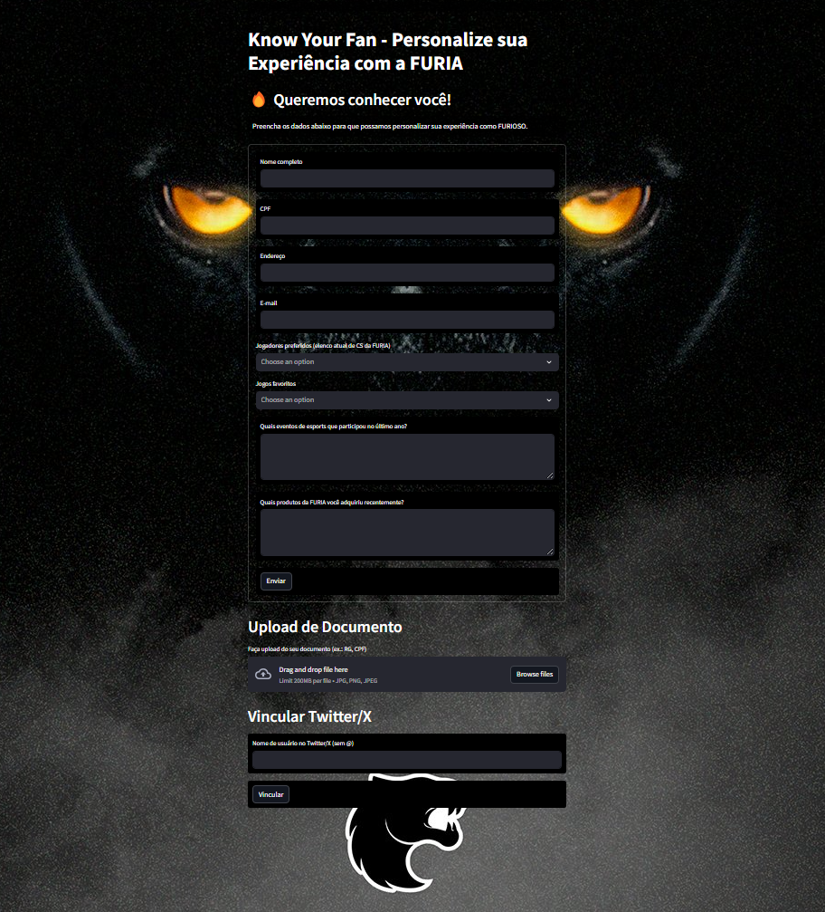

# Know Your Fan - Aplicação e Protótipo para Fãs da FURIA 🐯🔥

Bem-vindo ao **Know Your Fan**! Este é um projeto criado para o **Challenge #2 da FURIA**, com o objetivo de conhecer melhor os fãs do time e oferecer experiências personalizadas. Este sistema coleta informações sobre você, valida documentos, conecta redes sociais e sugere experiências incríveis!

### 👉[Acesse Aqui](https://furia-487cb4f5168c.herokuapp.com/)

### Aviso sobre o Deploy
Devido a limitações de tamanho de armazenamento no Heroku, o deploy atual não está atualizado com a versão mais recente do projeto. O tamanho do arquivo ultrapassa o limite de armazenamento do Heroku, o que impede o envio da versão mais atual.

Para rodar a versão mais atualizada, recomendamos que você configure o ambiente localmente. Siga as instruções abaixo para rodar o projeto localmente.



## 🌟 O que este projeto faz?

Este protótipo foi desenvolvido para ajudar clubes como a FURIA a conhecerem seus fãs de esports. Ele permite:

- 📋 **Coletar dados básicos**: Nome, CPF, endereço, e-mails, jogos e jogadores favoritos, eventos que você participou e produtos do time que comprou no último ano.
- 🖼️ **Validar documentos**: Faz upload de documentos (como RG ou CPF) e usa inteligência artificial para verificar se são válidos.
- 📱 **Conectar redes sociais**: Vincula sua conta do Twitter/X para analisar interações e páginas seguidas (simulado devido ao plano gratuito).
- 🎯 **Recomendar experiências**: Sugere eventos, produtos e conteúdos personalizados com base no seu perfil, como os próximos campeonatos da FURIA, itens da loja oficial ou workshops.

---

## 🛠️ Como configurar e usar

Siga os passos abaixo para rodar o projeto no seu computador! Não se preocupe, é bem simples.

### 1️⃣ Pré-requisitos

Você vai precisar de algumas coisas antes de começar:

- 🐍 **Python 3.8 ou superior** instalado no seu computador.
- 📖 **Tesseract OCR** para validar documentos:
  - No Windows, baixe e instale do [GitHub do Tesseract](https://github.com/UB-Mannheim/tesseract/wiki).
  - Certifique-se de que o Tesseract está no PATH ou ajuste o caminho no código (já configurado para `C:\Program Files\Tesseract-OCR\tesseract.exe`).

### 2️⃣ Baixe o projeto

Clone este repositório para o seu computador:

```bash
git clone https://github.com/rajssq/know-your-fan.git
cd KnowYourFan
```

### 3️⃣ Instale as dependências

Instale as bibliotecas necessárias para o projeto:

```bash
pip install streamlit pandas pytesseract Pillow scikit-learn numpy
```

### 4️⃣ Rode o aplicativo

Agora, é só executar o comando abaixo e o app abrirá no seu navegador:

```bash
streamlit run app.py
```

Você verá o app no endereço `http://localhost:8501`. 🌐

---

## 📖 Como usar o app

1. **Preencha seus dados** 📝  
   Na seção "🔥 Queremos conhecer você!", insira suas informações pessoais, como nome, CPF, endereço e e-mail. Você também pode selecionar seus jogadores favoritos da FURIA (como FalleN ou KSCERATO), jogos preferidos (CS:GO, Valorant, etc.), eventos que participou e produtos que comprou.

2. **Faça upload do documento** 🖼️  
   Na seção "Upload de Documento", envie uma imagem do seu RG ou CPF (em formato JPG ou PNG). O app usará IA para verificar se o documento é válido.

3. **Vincule sua conta do Twitter/X** 📱  
   Na seção "Vincular Twitter/X", insira seu nome de usuário (sem o @). O app mostrará as páginas que você segue e suas interações relacionadas a esports (simuladas, já que não usamos a API do Twitter/X devido às limitações do plano free).

4. **Receba recomendações personalizadas** 🎯  
   Depois de preencher seus dados, o app mostrará:
   - **Recomendações Personalizadas**: Sugere uma combinação de eventos (ex.: PGL Astana 2025), produtos (ex.: Camiseta FURIA x Adidas) e conteúdos/workshops (ex.: Workshop Valorant), com base nas suas preferências.
   - **Sugestões para Você**: Links para seguir seus jogadores favoritos no Twitter/X ou sugestões de produtos personalizados.

---

## 🤖 Sobre o Modelo de Machine Learning

O projeto utiliza o modelo **K-Nearest Neighbors (KNN)** para gerar recomendações personalizadas. O KNN funciona encontrando as experiências mais próximas com base nas preferências do usuário (jogos, jogadores, eventos e compras), representadas como um vetor de características. O modelo foi configurado para priorizar diversidade, garantindo que as recomendações incluam diferentes tipos de experiências (eventos, produtos e conteúdos/workshops).

No entanto, no estado atual do código, o modelo KNN não está totalmente funcional como esperado. As recomendações estão sendo geradas mais com base em **lógica pura** (regras fixas definidas no código) do que no aprendizado de padrões a partir dos dados. Isso significa que as sugestões podem não variar tanto quanto o ideal, dependendo das entradas do usuário. Para uma versão mais robusta, seria necessário ajustar as features do usuário, aumentar o conjunto de dados de experiências e refinar o treinamento do modelo.

---

## 📂 Estrutura do projeto

Aqui está como os arquivos estão organizados:

- `app.py` 🖥️: O código principal do aplicativo.
- `KnowYourFan.ipynb` 📓: Protótipo acessível no Jupyter Notebook.
- `fan_data.db` 💾: Banco de dados SQLite onde os dados dos usuários são salvos (não versionado no GitHub).
- `README.md` 📜: Esta documentação que você está lendo agora.
- `requirements.txt` 📋: Lista de bibliotecas necessárias para rodar o projeto.

---

## ⚠️ Notas importantes

- **Validação de documentos** 🖼️: Usei o Tesseract OCR localmente para evitar depender de APIs externas, como o Google Cloud Vision.
- **Integração com Twitter/X** 📱: Como estamos no plano gratuito, os dados do Twitter/X são simulados. Em um ambiente real, usaríamos a API do Twitter/X para coletar dados reais.
- **Modelo de IA**: Como mencionado, o modelo KNN foi implementado, mas as recomendações atuais dependem mais de lógica fixa do que do aprendizado de máquina.

---

## 💻 Desenvolvido por:

Raissa Nazaré
